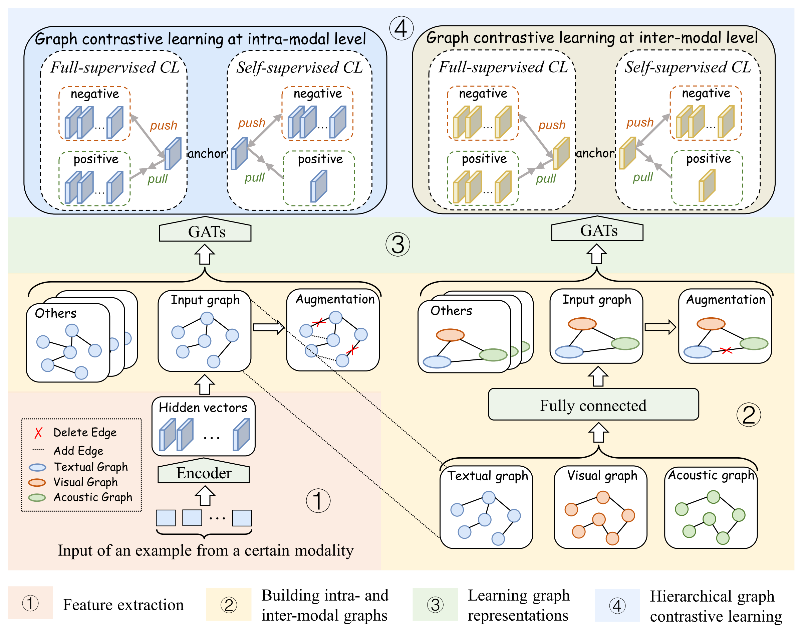

# Introduction

Code for COLING 2022 paper: *[Modeling Intra- and Inter-Modal Relations: Hierarchical Graph Contrastive Learning for Multimodal Sentiment Analysis](https://aclanthology.org/2022.coling-1.622/)*




## Dependencies

* PyTorch
* transformers


## Getting Start

First, clone this repo via:

```bash
git clone https://github.com/lzjjeff/HGraph-CL.git
cd TCSP
```

Next, creating some necessary folds via:
```bash
mkdir data save
cd save && mkdir mosi mosei 
cd ..
```

## Data

We evaluate our model on two benchmarks MOSI and MOSEI.

The data for experiment are placed in `./data/`, you can download the processed MOSI and MOSEI datasets from:

| Dataset | Link                                                        |
| ------- | ------------------------------------------------------------ |
| MOSI    | *[GoogleDrive](https://drive.google.com/file/d/172iNTfiJq4ChN8XyrwIW6NFHVgtYgOVt/view?usp=sharing)* |
| MOSEI   | *[GoogleDrive](https://drive.google.com/file/d/119n_beAYaMImWmNNF7vstK3ckxhRgrvc/view?usp=sharing)* |

and place them to `./data/`.

For more specific introduction about the two datasets, please refer to *[CMU-MultimodalSDK](https://github.com/A2Zadeh/CMU-MultimodalSDK)*.


## Train & Test
Take MOSEI as an example, you can train and test the two model at once via:

```bash
export DATASET=mosei

python run.py \
    --dataset ${DATASET} \
    --batch_size 24 \
    --max_len 128 \
    --embed_type bert_word \
    --seeds 42 \
    --do_train \
    --do_predict \
    --save_path ./save/${DATASET}/ \
    --device_ids 0 \
    --epoch 6 \
    --lr_bert 1e-5 \
    --lr_other 1e-3 \
    --weight_decay_bert 1e-5 \
    --weight_decay_other 1e-3 \
    --hidden_size 128 \
    --num_lstm_layers 1 \
    --num_gnn_layers 1 \
    --num_gnn_heads 1 \
    --dropout 0.1 \
    --dropout_gnn 0.1 \
    --aug_ratio 0.2 \
    --used_mode lva \
    --sup_cl_weight 0.1 \
    --self_cl_weight 0.1
```

## Citation
```text
@inproceedings{lin-etal-2022-modeling,
    title = "Modeling Intra- and Inter-Modal Relations: Hierarchical Graph Contrastive Learning for Multimodal Sentiment Analysis",
    author = "Lin, Zijie  and
      Liang, Bin  and
      Long, Yunfei  and
      Dang, Yixue  and
      Yang, Min  and
      Zhang, Min  and
      Xu, Ruifeng",
    booktitle = "Proceedings of the 29th International Conference on Computational Linguistics",
    month = oct,
    year = "2022",
    address = "Gyeongju, Republic of Korea",
    publisher = "International Committee on Computational Linguistics",
    url = "https://aclanthology.org/2022.coling-1.622",
    pages = "7124--7135",
}
```
